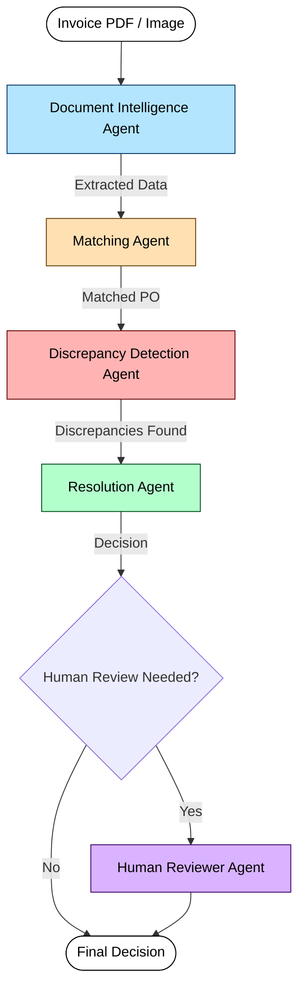
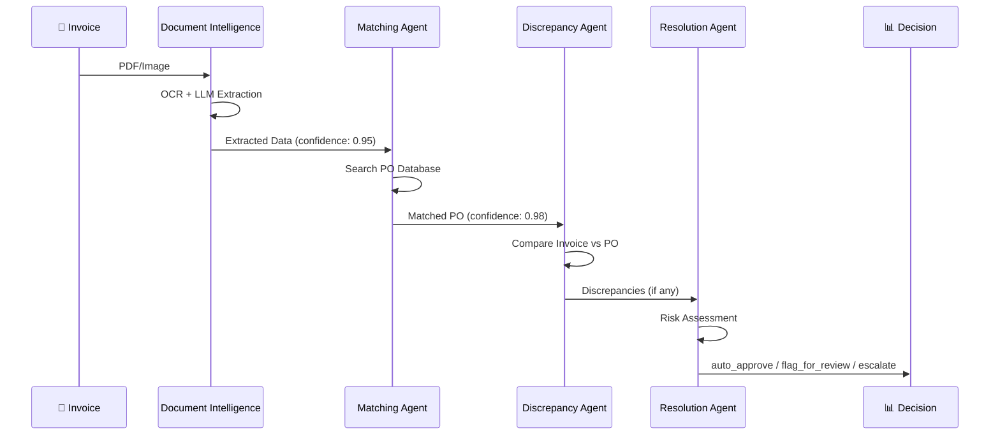
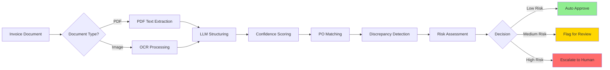

# 🤖 Invoice Reconciliation System

> An intelligent AI system that automatically processes invoices, matches them to purchase orders, detects discrepancies, and recommends actions—all with full explainability.

[](https://github.com/saikiranpulagalla/Invoice_Reconciliation_System)
[]()
[]()
[]()

---

## 🎯 What Does This Do?

Imagine you receive hundreds of invoices from suppliers. Each one needs to be:
1. **Read and understood** (even if it's a scanned image or PDF)
2. **Matched to a purchase order** (finding the right PO in your database)
3. **Checked for errors** (wrong prices, quantities, or missing information)
4. **Decided on** (approve automatically, flag for review, or escalate to human)

This system does all of that **automatically** using AI agents that work together, explain their decisions, and handle real-world messiness.

---

## 🏗️ Architecture

### System Overview



### Agent Communication Flow



### Data Flow



---

## 🤖 The Five Agents

### 1. 📄 Document Intelligence Agent
**What it does**: Reads invoices and extracts structured data

- Handles PDFs, scanned images, and photos
- Uses OCR (Optical Character Recognition) for images
- Uses AI to understand invoice structure
- Assigns confidence scores to every field

**Example**:
```
Input: Scanned invoice image
Output: {
  "invoice_number": "INV-2024-001",
  "supplier": "Acme Corp",
  "total": 1100.00,
  "confidence": 0.92
}
```

### 2. 🔍 Matching Agent
**What it does**: Finds the right purchase order for each invoice

- **Strategy 1**: Exact PO number match (if invoice has PO reference)
- **Strategy 2**: Fuzzy matching by supplier + products (if no PO reference)
- **Strategy 3**: Product-only matching (last resort)

**Example**:
```
Invoice says: "PO-2024-001"
→ Finds exact match in database (confidence: 0.99)

Invoice has no PO number but from "Acme Corp"
→ Fuzzy matches to PO-2024-001 (confidence: 0.70)
```

### 3. ⚠️ Discrepancy Detection Agent
**What it does**: Compares invoice to purchase order and finds problems

- Price mismatches (e.g., £88 instead of £80)
- Quantity differences
- Missing items or extra items
- Wrong supplier

**Example**:
```
PO says: Ibuprofen @ £80.00
Invoice says: Ibuprofen @ £88.00
→ Detects 10% price increase (severity: medium)
```

### 4. ✅ Resolution Agent
**What it does**: Decides what to do with the invoice

- **Auto-approve**: Everything matches perfectly (low risk)
- **Flag for review**: Minor issues need human check (medium risk)
- **Escalate to human**: Serious problems need immediate attention (high risk)

**Fast-Path Optimization** ⚡: Perfect matches (exact PO + supplier verified + no discrepancies) skip risk aggregation and auto-approve immediately, preventing any chance of regression.

**Example**:
```
Risk Assessment:
- Extraction: 0.10 (low risk)
- Matching: 0.10 (low risk)
- Discrepancies: 0.45 (medium risk - 10% price increase)

Decision: flag_for_review
Reason: "Price discrepancy detected requiring human review"
```

### 5. 👤 Human Reviewer Agent
**What it does**: Provides human feedback and decision override capability

- Reviews flagged invoices
- Provides feedback to improve system
- Can override automated decisions
- Learns from human corrections

**Example**:
```
System says: flag_for_review (price discrepancy)
Human says: "This is acceptable - approve it"
→ System learns and improves for similar cases
```

---

## 🚀 Quick Start

### Prerequisites

- Python 3.10 or higher
- Google API key (for Gemini AI) or OpenAI API key

### Installation

1. **Clone the repository**
```bash
git clone https://github.com/saikiranpulagalla/Invoice_Reconciliation_System.git
cd Invoice_Reconciliation_System
```

2. **Install dependencies**
```bash
pip install -r requirements.txt
```

3. **Set up environment variables**

Create a `.env` file:
```bash
# For Google Gemini (Free tier available)
LLM_PROVIDER=gemini
GOOGLE_API_KEY=your_google_api_key_here
LLM_MODEL=gemini-2.5-flash

# OR for OpenAI
# LLM_PROVIDER=openai
# LLM_API_KEY=your_openai_api_key_here
# LLM_MODEL=gpt-4-turbo
```

4. **Install Tesseract OCR** (optional, for scanned images)

**Windows**:
- Download from: https://github.com/UB-Mannheim/tesseract/wiki
- Install and add to PATH

**Mac**:
```bash
brew install tesseract
```

**Linux**:
```bash
sudo apt-get install tesseract-ocr
```

### Run Your First Invoice

```python
import asyncio
from app.main import process_invoice

# Process a single invoice
output = asyncio.run(process_invoice(
    document_path="path/to/invoice.pdf",
    invoice_id="INV-001"
))

# See the decision
print(f"Action: {output.processing_results.recommended_action}")
print(f"Reasoning: {output.processing_results.action_reasoning}")
```

---

## 📊 Example Output

```json
{
  "invoice_id": "INV-2024-004",
  "processing_results": {
    "extraction_confidence": 0.95,
    "document_quality": "good",
    "extracted_data": {
      "invoice_number": "INV-2024-004",
      "supplier": "Global Pharma Supply Co.",
      "total": 13476.00,
      "line_items_count": 3
    },
    "matching_results": {
      "matched_po": "PO-2024-004",
      "match_confidence": 0.98,
      "match_type": "exact_reference"
    },
    "discrepancies": [
      {
        "type": "price_mismatch",
        "severity": "medium",
        "confidence": 0.85,
        "invoice_value": 88.00,
        "po_value": 80.00,
        "explanation": "Unit price discrepancy in 'Ibuprofen BP 200mg': Invoice £88.00 vs PO £80.00 (+10.0%)"
      }
    ],
    "recommended_action": "flag_for_review",
    "action_reasoning": "Price discrepancy detected requiring human review"
  }
}
```

---

## 🧪 Testing

### Run All Tests
```bash
pytest tests/ -v
```

### Run Critical Tests (Invoice 4 & 5)
```bash
# Test 1: Price discrepancy detection (10% increase)
pytest tests/test_critical_invoices.py::test_invoice_4_price_discrepancy_detection -v -s

# Test 2: Missing PO reference (fuzzy matching)
pytest tests/test_critical_invoices.py::test_invoice_5_fuzzy_matching_no_po_reference -v -s
```

**Expected Results**:
- ✅ Invoice 4: Detects £88 vs £80 (10% variance) → `flag_for_review`
- ✅ Invoice 5: Fuzzy matches to PO-2024-005 → `flag_for_review`

### Test Coverage
```bash
pytest tests/ --cov=app --cov-report=html
```

---

## 🎓 How It Works (Simple Explanation)

### Step 1: Reading the Invoice
```
Invoice PDF → OCR (if image) → AI reads it → Structured data
```
The system can read both clean PDFs and messy scanned images.

### Step 2: Finding the Purchase Order
```
Invoice says "PO-2024-001" → Search database → Found!
OR
Invoice has no PO → Match by supplier + products → Found PO-2024-005
```

### Step 3: Checking for Problems
```
Compare invoice to PO:
- Prices match? ✓
- Quantities match? ✓
- Supplier correct? ✓
- Wait... price is £88 instead of £80! ⚠️
```

### Step 4: Making a Decision
```
Risk Assessment:
- Document quality: Good (0.95)
- PO match: Exact (0.98)
- Discrepancy: Medium (price 10% higher)

Decision: Flag for human review
```

---

## 🔧 Configuration

Edit `app/config.py` or use environment variables:

| Setting | Default | Description |
|---------|---------|-------------|
| `LLM_PROVIDER` | `gemini` | AI provider (gemini/openai) |
| `LLM_MODEL` | `gemini-2.5-flash` | AI model to use |
| `ENABLE_OCR` | `true` | Enable OCR for images |
| `PRICE_VARIANCE_TOLERANCE` | `0.02` | 2% price tolerance |
| `QUANTITY_VARIANCE_TOLERANCE` | `0.05` | 5% quantity tolerance |

---

## 📁 Project Structure

```
Invoice_Reconciliation_System/
├── app/
│   ├── agents/              # The 5 AI agents
│   │   ├── document_intelligence.py
│   │   ├── matching.py
│   │   ├── discrepancy.py
│   │   ├── resolution.py
│   │   └── human_reviewer.py
│   ├── schemas/             # Data structures
│   │   ├── invoice.py
│   │   ├── po.py
│   │   └── output.py
│   ├── utils/               # Helper functions
│   │   ├── ocr.py
│   │   ├── confidence.py
│   │   ├── logging.py
│   │   └── preprocessing.py
│   ├── graph.py             # LangGraph orchestration
│   ├── state.py             # Shared state
│   ├── config.py            # Configuration
│   └── main.py              # Entry point
├── tests/                   # Test suite
│   ├── test_critical_invoices.py
│   ├── test_discrepancy.py
│   ├── test_matching.py
│   ├── test_confidence.py
│   ├── test_error_cases.py
│   └── test_integration.py
├── requirements.txt         # Dependencies
├── .env                     # Your API keys (not in git)
└── README.md               # This file
```

---

## 🎯 Key Features

### ✅ Real Multi-Agent System
Not just a pipeline—agents communicate, share state, and make decisions together using LangGraph.

### ✅ Confidence Scoring
Every extraction, match, and decision has a confidence score (0.0 to 1.0).

### ✅ Full Explainability
Every decision is explained in plain English. You can see exactly why the system made each choice.

### ✅ Handles Messy Documents
- Scanned images
- Rotated documents
- Poor quality PDFs
- Handwritten notes (with limitations)

### ✅ Smart Matching
- Exact PO reference matching
- Fuzzy matching when PO is missing
- Handles supplier name variations

### ✅ Detects Hidden Issues
- Price increases (even small ones like 10%)
- Quantity mismatches
- Missing items
- Wrong suppliers

---

## 🧠 Decision Logic

### Auto-Approve (Low Risk)
- ✅ Exact PO match
- ✅ All items match perfectly
- ✅ No discrepancies
- ✅ High confidence (>90%)

### Flag for Review (Medium Risk)
- ⚠️ Minor price differences (5-15%)
- ⚠️ Fuzzy PO match
- ⚠️ Some items don't align
- ⚠️ Medium confidence (70-90%)

### Escalate to Human (High Risk)
- ❌ Large price differences (>15%)
- ❌ No matching PO found
- ❌ Multiple serious issues
- ❌ Low confidence (<70%)

---

## 🐛 Troubleshooting

### "No module named 'pytesseract'"
```bash
pip install pytesseract
# Then install Tesseract OCR (see installation section)
```

### "API rate limit exceeded"
```bash
# For Gemini: Wait 4 seconds between requests (built-in)
# For OpenAI: Reduce batch size or upgrade plan
```

### "No matching PO found"
- Check that `app/data/purchase_orders.json` exists
- Verify supplier names match exactly
- Try fuzzy matching by removing PO reference

### Tests failing
```bash
# Make sure you have API key set
export GOOGLE_API_KEY=your_key_here

# Run tests with verbose output
pytest tests/ -v -s
```

---

## 📈 Performance

- **Single invoice**: ~10-15 seconds
- **Batch of 5**: ~1 minute
- **Target**: Process 5 invoices in under 5 minutes ✅

**Bottlenecks**:
- LLM API calls (2-3 per invoice)
- OCR processing for images
- Rate limits (Gemini: 15 requests/minute)

**Optimizations**:
- Async processing
- Batch processing support
- Caching (planned)
- Parallel processing (planned)

---

## 🔒 Security & Privacy

- API keys stored in `.env` (not committed to git)
- No data sent to external services except LLM API
- All processing happens locally except AI calls
- Logs don't contain sensitive data

---

## 🤝 Contributing

This is an internship assessment project, but improvements are welcome:

1. Fork the repository
2. Create a feature branch
3. Make your changes
4. Add tests
5. Submit a pull request

---


## 🙏 Acknowledgments

- Built with [LangGraph](https://github.com/langchain-ai/langgraph) for agent orchestration
- Uses [LangChain](https://github.com/langchain-ai/langchain) for LLM abstractions
- OCR powered by [Tesseract](https://github.com/tesseract-ocr/tesseract)
- Fuzzy matching with [RapidFuzz](https://github.com/maxbachmann/RapidFuzz)

---

## 📧 Contact

For questions or issues:
- Check the logs: `invoice_reconciliation.log`
- Enable debug mode: `LOG_LEVEL=DEBUG`
- Review test cases: `tests/test_critical_invoices.py`

---

## 🎓 Assignment Context

This project was built for the NIYAMRAI Agent Development Internship technical assessment. It demonstrates:

- ✅ Multi-agent architecture (not a linear pipeline)
- ✅ Intelligent agent communication and handoffs
- ✅ Confidence scoring and uncertainty handling
- ✅ Real-world document processing
- ✅ Explainable AI decisions
- ✅ Production-ready code quality

**Critical Test Cases**:
1. **Invoice 4**: Detects 10% price increase (£88 vs £80) ✅
2. **Invoice 5**: Fuzzy matches despite missing PO reference ✅

Both tests pass with correct confidence scores and recommendations.

---

**Built with ❤️ for intelligent invoice processing**
